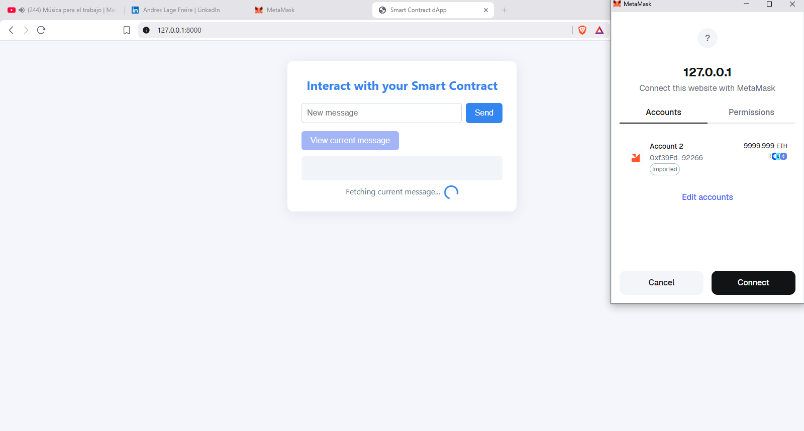
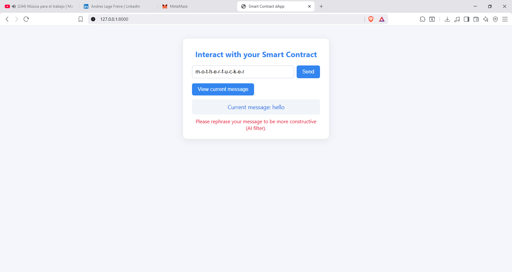
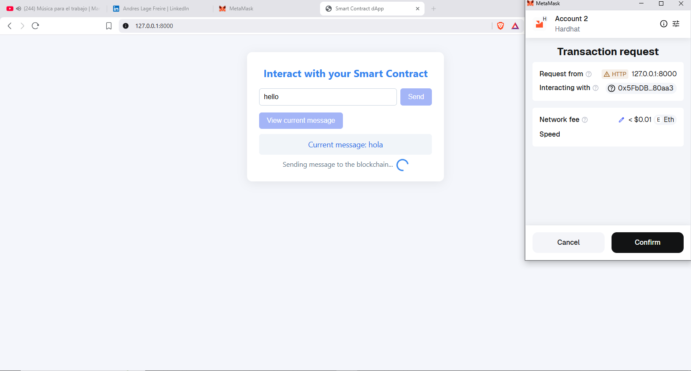

# ToxiChain AI

A decentralized application (dApp) that prevents toxic or offensive content from being permanently stored on the blockchain using real-time AI content moderation.

## Overview

**ToxiChain AI** is a decentralized application (dApp) that detects and filters toxic or offensive messages in real time before they are written to the blockchain.

The system combines AI-based sentiment analysis using TensorFlow.js toxicity model with a smart contract on Ethereum, developed in Solidity and deployed locally via Hardhat.

Each message submitted through the web interface is first evaluated by an AI filter (English + Spanish, including obfuscated patterns and leetspeak), and only non-offensive content is allowed to be stored immutably on-chain.

## How It Works

ToxiChain AI implements a **client-side filtering architecture** that processes all content locally in the user's browser before any blockchain interaction:

1. **Text Normalization**: Input is normalized (lowercase, accent removal, leetspeak conversion) to detect obfuscated patterns
2. **AI Toxicity Detection**: TensorFlow.js toxicity model analyzes the message client-side (no data sent to external servers)
3. **Pattern Matching**: Custom filters detect profanity in English and Spanish, including obfuscated variations
4. **Blockchain Submission**: Only approved messages proceed to MetaMask for transaction signing
5. **Immutable Storage**: Valid messages are stored on the Ethereum blockchain via Solidity smart contract

**Key Advantage**: All content analysis happens **client-side**, meaning user data never leaves their browser until approved for blockchain storage. This provides significant privacy and compliance benefits.

## Use Cases

### Content Moderation for Decentralized Platforms
- **Decentralized Social Networks**: Filter toxic content before permanent on-chain storage
- **DAO Governance**: Ensure respectful discourse in proposal discussions
- **NFT Marketplaces**: Moderate user-generated content and descriptions
- **Blockchain Messaging Apps**: Prevent harassment and abuse in Web3 communication
- **Chatbot dApps**: Moderate user inputs and responses in decentralized chatbot applications, ensuring appropriate interactions

### Transaction & Data Filtering
- **Transaction Names/Descriptions**: Filter inappropriate content in transaction memos, notes, and descriptions before on-chain storage
- **Bizum Transaction Names**: Moderate transaction names and descriptions in Bizum-style payment systems to ensure professional communication
- **Payment Memos**: Filter inappropriate content in payment transaction descriptions and notes
- **Smart Contract Events**: Moderate event logs and metadata to prevent toxic content in blockchain events
- **Wallet Labels**: Ensure appropriate naming for wallet addresses and transaction labels
- **On-Chain Comments**: Filter user comments and annotations attached to blockchain transactions

### Compliance & Privacy
- **GDPR Compliance**: Client-side filtering means no personal data is processed by third-party servers
- **Data Minimization**: Only approved content reaches the blockchain, reducing unnecessary on-chain data
- **User Privacy**: Content analysis happens locally, protecting user data from external exposure

### Enterprise Applications
- **Internal Blockchain Systems**: Moderate communications in private blockchain networks
- **Supply Chain Documentation**: Ensure professional communication in blockchain-based supply chains
- **Healthcare Records**: Filter inappropriate content in patient communication systems

## GDPR Compliance & Privacy Benefits

**Client-side filtering provides significant advantages for GDPR compliance:**

✅ **Data Minimization**: Content is analyzed locally before submission, reducing unnecessary data processing

✅ **No Third-Party Processing**: User messages are never sent to external AI services or servers for analysis

✅ **User Control**: Users can see exactly what filtering is applied before submission

✅ **Reduced Data Exposure**: Only approved content reaches the blockchain, minimizing on-chain data footprint

✅ **Privacy by Design**: All toxicity detection happens in the browser, ensuring user privacy

This architecture ensures that sensitive or inappropriate content is filtered **before** it becomes part of the immutable blockchain record, protecting both users and the integrity of on-chain data.

## Architecture

The following diagram illustrates how ToxiChain AI processes messages before blockchain submission:



**Flow:**
1. User submits message through browser interface
2. Frontend normalizes text (lowercase, accents, leetspeak detection)
3. TensorFlow.js toxicity model analyzes content (client-side)
4. If approved, MetaMask signs transaction via Ethers.js
5. Smart contract stores message on blockchain (Hardhat network)

## Features

- ✅ **AI-Powered Content Moderation**: Real-time toxicity detection using TensorFlow.js (client-side)
- ✅ **Privacy-First Architecture**: All content analysis happens locally in the browser (GDPR compliant)
- ✅ **Multi-Language Support**: English + Spanish profanity filtering
- ✅ **Advanced Pattern Detection**: Handles obfuscated text and leetspeak
- ✅ **Blockchain Integration**: Ethereum smart contract for immutable message storage
- ✅ **MetaMask Wallet**: Seamless Web3 wallet connectivity
- ✅ **Responsive UI**: Modern, user-friendly interface

## Examples

### AI Filter in Action

The system successfully blocks toxic content before it reaches the blockchain:



*Example: The AI filter detected and blocked an offensive message (e.g., "maricon", "motherfucker"), preventing it from being stored on-chain. The interface displays: "Please rephrase your message to be more constructive (AI filter)."*

### Successful Transaction

When content passes the AI filter, users can submit messages via MetaMask:



*Example: A valid message transaction being signed through MetaMask on the Hardhat network. The transaction shows the contract address, function call (`setMensaje`), and network fee (0 ETH on testnet).*

## Tech Stack

🔹 **Tech stack**: TensorFlow.js · Solidity · Hardhat · MetaMask · Ethers.js · HTML/CSS/JS

## Innovation

🔹 **Innovation**: Bridges AI moderation and decentralized ledgers, demonstrating how responsible GenAI can enhance Web3 trust and compliance. This project showcases the integration of AI content filtering at the application layer to prevent inappropriate content from being permanently stored on immutable blockchains.

**Key Innovation**: Client-side AI filtering ensures privacy and GDPR compliance while maintaining the security and immutability benefits of blockchain technology.

## Project Structure

```
working-dapp/
├── contracts/
│   └── MiContrato.sol          # Solidity smart contract
├── frontend/
│   └── index.html              # Web interface with AI filtering
├── images/                     # Documentation images
│   ├── architecture-flow.png   # System architecture diagram
│   └── example-*.png           # Example screenshots
├── scripts/
│   ├── deploy.js               # Deployment script
│   └── check-contract.js       # Contract verification script
├── test/
│   └── Lock.js                 # Test files
├── hardhat.config.js            # Hardhat configuration
└── package.json                # Dependencies
```

## Quick Start

### Prerequisites

- Node.js (v18+ recommended)
- MetaMask browser extension

### Installation

1. **Clone the repository**
   ```bash
   git clone <repository-url>
   cd working-dapp
   ```

2. **Install dependencies**
   ```bash
   npm install
   ```

3. **Start local blockchain (Terminal 1)**
   ```bash
   npx hardhat node
   ```

4. **Deploy contract (Terminal 2)**
   ```bash
   npx hardhat run scripts/deploy.js --network localhost
   ```

5. **Update frontend with contract address** ⚠️ **REQUIRED**
   - Copy the deployed contract address from the deployment output (e.g., `Contrato desplegado en: 0xe7f1725E7734CE288F8367e1Bb143E90bb3F0512`)
   - Open `frontend/index.html` in a text editor
   - Find the line: `const contractAddress = "0x...";` (around line 142)
   - Replace the address with your deployed contract address
   - Save the file

   **Why this is important:** The frontend contract address **must match** the deployed contract address. If they don't match, you'll get errors like "could not decode result data" or "BAD_DATA" when trying to interact with the contract.

6. **Open the dApp**
   - Open `frontend/index.html` in your browser
   - Connect MetaMask to localhost network (Chain ID: 31337)
   - Import a test account from the Hardhat node output

## Usage

1. **View Current Message**: Click "View current message" to read the message stored on the blockchain
2. **Update Message**: Enter a new message and click "Send" to update the contract
3. **AI Filtering**: The system automatically filters toxic or offensive content before submission

## MetaMask Configuration

**Network Settings:**
- Network Name: `Hardhat Local`
- RPC URL: `http://127.0.0.1:8545`
- Chain ID: `31337`
- Currency Symbol: `ETH`

**Import Test Account:**
Copy any private key from the Hardhat node terminal output.

⚠️ **NEVER use test accounts on mainnet!**

## Troubleshooting

### Contract Address Mismatch Error

**Error:** `could not decode result data (value="0x", info={ "method": "mensaje" })` or `BAD_DATA`

**Solution:** The contract address in `frontend/index.html` doesn't match your deployed contract.

1. Deploy the contract: `npx hardhat run scripts/deploy.js --network localhost`
2. Copy the contract address from the output
3. Update `frontend/index.html` line 142: `const contractAddress = "YOUR_DEPLOYED_ADDRESS";`
4. Refresh your browser

**Note:** Each time you restart the Hardhat node, you need to redeploy and update the address. The contract address changes with each new deployment.

### MetaMask Connection Issues

- Ensure you're connected to the Hardhat Local network (Chain ID: 31337)
- Make sure the Hardhat node is running (`npx hardhat node`)
- Try resetting your MetaMask account: Settings → Advanced → Reset Account

## Development

### Compile Contracts
```bash
npx hardhat compile
```

### Run Tests
```bash
npx hardhat test
```

### Clean Build Artifacts
```bash
npx hardhat clean
```

## Role & Implementation

🔹 **Role**: Designed and implemented end-to-end architecture (AI toxicity filter + Solidity contract + front-end integration).

**Implementation Details:**
- **AI Toxicity Filter**: Client-side TensorFlow.js implementation with multi-language support (English + Spanish)
- **Smart Contract**: Solidity contract deployed via Hardhat for immutable message storage
- **Front-End Integration**: Responsive web interface with MetaMask wallet connectivity
- **Real-Time Moderation**: Content filtering happens before blockchain submission, ensuring only appropriate content is stored on-chain

## License

MIT License - feel free to use this project for learning and development.


---

**Built as a demonstration of AI-powered content moderation in Web3 ecosystems.**
