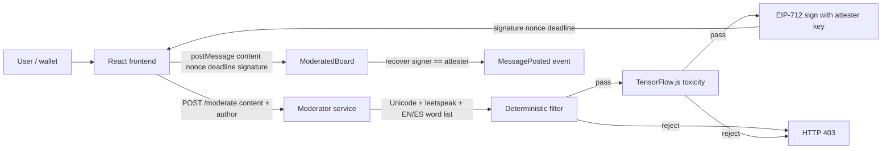

# ToxiChain

A fail-closed Ethereum message board. A message is written on-chain only after an authorized moderation service produces an EIP-712 attestation. Client-side TensorFlow.js in the browser is **not** a security boundary.

## Architecture


```mermaid
flowchart LR
  user[User / wallet] --> ui[React frontend]
  ui -->|POST /moderate content + author| mod[Moderator service]
  mod -->|Unicode + leetspeak + EN/ES word list| det[Deterministic filter]
  det -->|pass| tf[TensorFlow.js toxicity]
  det -->|reject| deny[HTTP 403]
  tf -->|pass| eip[EIP-712 sign with attester key]
  tf -->|reject| deny
  eip -->|signature nonce deadline| ui
  ui -->|postMessage content nonce deadline signature| chain[ModeratedBoard]
  chain -->|recover signer == attester| ev[MessagePosted event]
```

The contract never trusts the browser. It recovers the attester from the typed-data signature bound to `(content, author, nonce, deadline)` plus the EIP-712 domain (`chainId`, `address(this)`). Direct calls without a fresh attestation revert.

## Security model

### Why client-side-only v1 was insecure

v1 ran TensorFlow.js and word lists **in the browser**, then called `setMensaje` if the UI approved the text. Anyone can ignore that UI:

- Call `setMensaje` from Remix, `cast`, or a one-line ethers script.
- Replay or edit the page to skip `shouldBlockMessageBySentiment`.
- The contract had no notion of an attester, so the chain accepted any string within the length cap.

Client-side filtering is a UX hint, not enforcement. On-chain data is public and permanent; a bypass is a permanent toxic log.

### What v2 enforces

| Control | Where | Effect |
| --- | --- | --- |
| Deterministic filter (NFKC, homoglyphs, leetspeak, EN/ES lists) | Moderator service | Fast reject, no signature |
| TensorFlow.js toxicity | Moderator service | Second layer; threshold from env |
| EIP-712 attestation | Moderator signs, contract verifies | Only `attester` can approve a payload |
| Nonce + deadline | Contract | Replay and stale-attestation rejection |
| Fail-closed UI | Frontend | If `/moderate` is down or times out, the user sees **contenido no verificado** and no `postMessage` is sent |
| Event-only history | Contract | Content is emitted, not stored, to bound SSTORE / gas |

The attester private key lives only in the moderator process (`ATTESTER_PRIVATE_KEY`). It is never shipped to the frontend or committed to git.

### Threat model

**In scope**

- Users calling the contract directly to skip the old browser filter.
- Replaying a valid attestation for another message, nonce, chain, or board.
- Using an expired attestation.
- Compromised attester key (owner can rotate `setAttester`).
- Moderator timeout or crash (fail closed: no post).

**Out of scope / residual risk**

- A malicious or coerced attester can still sign toxic content. Operational security of that key is the trust root.
- The toxicity model has false negatives; the word list is not a complete language model.
- Event logs still publish accepted plaintext. Do not post secrets.
- Availability of the moderator is a liveness dependency (intentional: unpublished content is safer than unverified content).

## Project layout

```
Toxichain/
├── contracts/ModeratedBoard.sol   # Attestation-gated board (MiContrato.sol kept intact)
├── contracts/MiContrato.sol       # Legacy v1 contract
├── ignition/modules/ModeratedBoard.js
├── test/ModeratedBoard.js
├── moderator/                     # Express attester
├── frontend/                      # React + Vite + ethers
├── scripts/deploy.js              # Local deploy
├── scripts/deploy-sepolia.js      # Sepolia deploy → deployment.json
└── .env.example
```

## Prerequisites

- Node.js 18+ (20 recommended)
- MetaMask
- For Sepolia: an RPC URL and a funded deployer key

## Install

```bash
git clone https://github.com/tshapedconsultant/Toxichain.git
cd Toxichain
npm install
npm install --prefix moderator
npm install --prefix frontend
copy .env.example .env
copy frontend\.env.example frontend\.env
```

On macOS / Linux use `cp` instead of `copy`. Fill `.env` with an attester key (a dedicated wallet, never a mainnet mnemonic).

## Local demo

Terminal 1 — chain:

```bash
npm run node
```

Terminal 2 — deploy `ModeratedBoard` (attester defaults to the first Hardhat account unless `ATTESTER_ADDRESS` is set):

```bash
npx hardhat run scripts/deploy.js --network localhost
```

Copy the printed address into:

- `.env` → `CONTRACT_ADDRESS`
- `frontend/.env` → `VITE_CONTRACT_ADDRESS`
- `.env` → `ATTESTER_PRIVATE_KEY` matching `ATTESTER_ADDRESS`

Terminal 3 — moderator:

```bash
npm start --prefix moderator
```

Terminal 4 — UI:

```bash
npm run frontend:dev
```

MetaMask network:

- Name: `Hardhat Local`
- RPC: `http://127.0.0.1:8545`
- Chain ID: `31337`

Import a Hardhat test account. **Never use those keys on a public network.**

Alternatively deploy with Ignition:

```bash
npx hardhat ignition deploy ignition/modules/ModeratedBoard.js --network localhost
```

## Sepolia deploy

1. Set `SEPOLIA_RPC_URL`, `SEPOLIA_PRIVATE_KEY`, and `ATTESTER_ADDRESS` in `.env`.
2. Run `npm run deploy:sepolia`.
3. The script prints the address and writes `deployment.json` (gitignored) for the frontend.
4. Point `CONTRACT_ADDRESS`, `CHAIN_ID=11155111`, and `frontend/.env` `VITE_CHAIN_ID=11155111` at that deployment.
5. Run the moderator with the **same** attester private key whose address was passed to the constructor.

## Scripts

| Script | Purpose |
| --- | --- |
| `npm run compile` | Compile Solidity |
| `npm test` | Contract tests (Hardhat) |
| `npm run test:moderator` | Moderator pipeline + attestation tests |
| `npm run node` | Local Hardhat chain |
| `npm run deploy:sepolia` | Deploy ModeratedBoard and write `deployment.json` |
| `npm run frontend:dev` | Vite dev server |

## Tests

```bash
npm test
npm run test:moderator
```

Moderator tests include ≥15 malicious payloads (leetspeak, letter-spacing, homoglyphs) and ≥15 benign ones, and print FP/FN rates.

## License

Copyright © 2025 **Andrés Lage** ([tshapedconsultant](https://github.com/tshapedconsultant)). GNU General Public License v3.0 — see [LICENSE](LICENSE).
