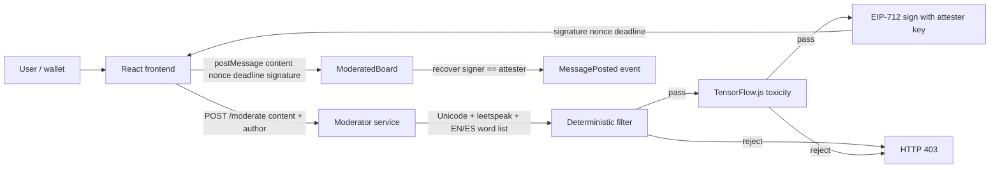

# ToxiChain

Tablón de mensajes **on-chain** con moderación previa. Un mensaje solo llega a Ethereum cuando un servicio de moderación autorizado firma una **attestation EIP-712**. El filtrado en el navegador **no** es un perímetro de seguridad.

ToxiChain is a moderated on-chain message board: the contract accepts `postMessage` only with a fresh attester signature. Client-side TensorFlow.js is a UX hint, not enforcement.

Licencia: [GNU GPL-3.0](LICENSE).

## Por qué el modelo v1 (solo cliente) era inseguro

La versión anterior ejecutaba TensorFlow.js y listas de palabras **en el navegador** y, si la UI aprobaba el texto, llamaba a `MiContrato.setMensaje`. Cualquiera podía ignorar esa UI:

- Llamar a `setMensaje` desde Remix, `cast`, o un script de ethers.
- Editar o rehacer la página para saltarse `shouldBlockMessageBySentiment`.
- El contrato no conocía un *attester*: aceptaba cualquier string dentro del límite de longitud.

El filtrado client-side no es enforcement. Los datos on-chain son públicos y permanentes; un bypass queda grabado para siempre.

Carpetas y flujos que **ya no existen** (aparecían en READMEs antiguos):

- `working-dapp/` — no hagas `git clone … && cd working-dapp`.
- `contrato/` — el Solidity vive en `contracts/`.
- Hardcodear `const contractAddress = "0x…"` en `frontend/index.html` — el cliente Vite lee `VITE_CONTRACT_ADDRESS`.

## Arquitectura


```mermaid
flowchart LR
  user[User / wallet] --> ui[React frontend]
  ui -->|POST /moderate content + author| mod[Moderator service]
  mod -->|Unicode + leetspeak + EN/ES word list| det[Deterministic filter]
  det -->|pass| tf[TensorFlow.js toxicity]
  det -->|reject| deny[HTTP 403]
  tf -->|pass| eip[EIP-712 sign with attester key]
  tf -->|reject| deny
  eip -->|signature nonce deadline| ui
  ui -->|postMessage content nonce deadline signature| chain[ModeratedBoard]
  chain -->|recover signer == attester| ev[MessagePosted event]
```

El contrato **nunca** confía en el browser. Recupera el firmante de la firma EIP-712 sobre `(content, author, nonce, deadline)` y el dominio (`name: ModeratedBoard`, `version: 1`, `chainId`, `address(this)`). `author` es `msg.sender`. Sin una attestation fresca, `postMessage` revierte.

El cuerpo del mensaje **no** se guarda en storage: se emite en `MessagePosted` (máximo 512 bytes) para que indexers y el frontend reconstruyan el feed.

## Modelo de seguridad

| Control | Dónde | Efecto |
| --- | --- | --- |
| Filtro determinista (NFKC, homoglifos, leetspeak, listas EN/ES) | Moderator | Rechazo rápido, sin firma |
| TensorFlow.js toxicity | Moderator | Segunda capa; umbral en `TOXICITY_THRESHOLD` |
| Attestation EIP-712 | El moderator firma; el contrato verifica | Solo `attester` puede aprobar un payload |
| Nonce + deadline | Contrato | Bloquea replay y attestations caducadas |
| Binding de `chainId` + `address(this)` | Dominio EIP-712 | Una firma de otra chain u otro board no vale |
| UI fail-closed | Frontend | Si `/moderate` cae o hace timeout: **contenido no verificado** y no se envía `postMessage` |
| Historial por eventos | Contrato | El contenido se emite, no se almacena (acota SSTORE / gas) |

La clave `ATTESTER_PRIVATE_KEY` vive solo en el proceso del moderator. **Nunca** se envía al frontend ni se commitea a git. **Nunca** subas `.env` ni claves.

### Threat model

**En alcance**

- Usuarios que llaman al contrato directo para saltarse el filtro del browser (el caso que rompía v1).
- Reutilizar una attestation válida para otro mensaje, nonce, chain o board.
- Usar una attestation caducada (`deadline`).
- Compromiso de la clave attester: el *owner* puede rotarla con `setAttester`.
- Timeout o crash del moderator (fail-closed: no hay post).

**Fuera de alcance / riesgo residual**

- Un attester malicioso o coaccionado **puede** firmar contenido tóxico. La seguridad operativa de esa clave es la raíz de confianza.
- El modelo de toxicity tiene falsos negativos; la word list no es un modelo de lenguaje completo.
- Los event logs publican el plaintext aceptado. No publiques secretos.
- La disponibilidad del moderator es una dependencia de liveness (es intencional: no publicar es más seguro que publicar sin verificar).
- **`MiContrato` sigue siendo bypasseable.** `contracts/MiContrato.sol` es el leftover de v1: `setMensaje` es público y no pide attestation. Si alguien lo despliega o apunta un cliente a esa dirección, la moderación no existe. El board soportado es **solo** `ModeratedBoard`.

## Prerrequisitos

- Node.js 18+ (20 recomendado)
- npm
- [MetaMask](https://metamask.io/)
- Para Sepolia: un RPC (`SEPOLIA_RPC_URL`) y una clave de deployer con ETH de testnet (`SEPOLIA_PRIVATE_KEY`)

## Instalación

```bash
git clone https://github.com/tshapedconsultant/Toxichain.git
cd Toxichain
npm install
npm install --prefix moderator
npm install --prefix frontend
```

Copia las plantillas de entorno. En PowerShell:

```powershell
copy .env.example .env
copy frontend\.env.example frontend\.env
```

En macOS / Linux: `cp .env.example .env` y `cp frontend/.env.example frontend/.env`.

Rellena `.env` y `frontend/.env` **en local**. No commitees esos archivos. No uses un mnemonic de mainnet.

## Demo local

Cuatro terminales. Tras cambiar `frontend/.env`, reinicia Vite: las variables `VITE_*` se leen al arrancar.

**Terminal 1 — cadena Hardhat**

```bash
npm run node
```

Deja el nodo en `http://127.0.0.1:8545` (chainId `31337`). Copia la **Account #0** (dirección y private key) del output: por defecto el deploy usa esa cuenta como *attester*.

**Terminal 2 — deploy de `ModeratedBoard`**

```bash
npx hardhat run scripts/deploy.js --network localhost
```

Si no hay `ATTESTER_ADDRESS` en `.env`, el attester es el primer signer de Hardhat. Copia la dirección impresa a:

| Archivo | Variable |
| --- | --- |
| `.env` | `CONTRACT_ADDRESS` |
| `.env` | `ATTESTER_ADDRESS` (la que imprimió el script) |
| `.env` | `ATTESTER_PRIVATE_KEY` (la private key de **esa** cuenta, p. ej. Account #0 del nodo) |
| `.env` | `CHAIN_ID=31337` |
| `frontend/.env` | `VITE_CONTRACT_ADDRESS` (la misma dirección del contrato) |
| `frontend/.env` | `VITE_MODERATOR_URL=http://127.0.0.1:3001` |
| `frontend/.env` | `VITE_CHAIN_ID=31337` |

Esas private keys de Hardhat son públicas y **solo** valen en localhost. Nunca las uses en Sepolia ni en mainnet.

**Terminal 3 — moderator**

```bash
npm start --prefix moderator
```

El servicio lee el `.env` de la **raíz** del repo. Arranca en `http://127.0.0.1:3001`. `GET /health` debe devolver el attester y el contrato.

**Terminal 4 — frontend**

```bash
npm run frontend:dev
```

Vite sirve en `http://127.0.0.1:5173`. En MetaMask:

- Network name: `Hardhat Local`
- RPC: `http://127.0.0.1:8545`
- Chain ID: `31337`
- Currency: `ETH`

Importa una cuenta de prueba del nodo. **Nunca uses esas keys en una red pública.**

Alternativa con Ignition (local):

```bash
npx hardhat ignition deploy ignition/modules/ModeratedBoard.js --network localhost
```

## Deploy en Sepolia

1. Crea un wallet **dedicado** para el attester (no reutilices keys de Hardhat).
2. En `.env` define `SEPOLIA_RPC_URL`, `SEPOLIA_PRIVATE_KEY` (deployer con ETH de testnet) y `ATTESTER_ADDRESS` (la address de esa clave attester).
3. Ejecuta `npm run deploy:sepolia`.
4. El script imprime la dirección y escribe `deployment.json` (está en `.gitignore`; no lo subas si contiene datos que no quieras compartir).
5. Apunta el resto del entorno a ese deploy:

   - `.env`: `CONTRACT_ADDRESS`, `CHAIN_ID=11155111`, `ATTESTER_PRIVATE_KEY` de la misma address que pasaste al constructor.
   - `frontend/.env`: `VITE_CONTRACT_ADDRESS`, `VITE_CHAIN_ID=11155111`, `VITE_MODERATOR_URL` (URL pública del moderator, no `127.0.0.1` si el UI no corre en tu máquina).

6. Arranca el moderator con esa misma clave. El contrato solo aceptará firmas de `ATTESTER_ADDRESS`.

## Variables de entorno

Plantillas: [`.env.example`](.env.example) y [`frontend/.env.example`](frontend/.env.example). **No commitees `.env` ni `frontend/.env`.**

### Raíz (Hardhat + moderator)

| Variable | Uso |
| --- | --- |
| `ATTESTER_PRIVATE_KEY` | Clave con la que el moderator firma EIP-712. Obligatoria para arrancar el servicio. |
| `ATTESTER_ADDRESS` | Address de esa clave. Local: opcional (cae al primer signer). Sepolia: **obligatoria**. |
| `CONTRACT_ADDRESS` | `ModeratedBoard` desplegado. El moderator la usa como `verifyingContract`. |
| `CHAIN_ID` | Dominio EIP-712. Local `31337`, Sepolia `11155111`. |
| `PORT` | Puerto HTTP del moderator (default `3001`). |
| `TOXICITY_THRESHOLD` | Umbral de `@tensorflow-models/toxicity` (default `0.7`). |
| `MODERATION_TIMEOUT_MS` | Timeout fail-closed del pipeline (default `1800`). |
| `ATTESTATION_TTL_SECONDS` | Vida del `deadline` (default `300`). |
| `FRONTEND_ORIGIN` | CORS. Local: `http://127.0.0.1:5173`. |
| `SKIP_TOXICITY` | `1` solo para depurar el pipeline local **sin** TF.js. En cualquier entorno real debe ser `0`. |
| `SEPOLIA_RPC_URL` | RPC de Sepolia para Hardhat. |
| `SEPOLIA_PRIVATE_KEY` | Deployer en Sepolia. Distinta de la attester si puedes. |

### Frontend (`frontend/.env`, prefijo `VITE_`)

| Variable | Uso |
| --- | --- |
| `VITE_CONTRACT_ADDRESS` | Mismo `ModeratedBoard` que el moderator. |
| `VITE_MODERATOR_URL` | Base URL del moderator (sin slash final). Local: `http://127.0.0.1:3001`. |
| `VITE_CHAIN_ID` | Debe coincidir con la red de MetaMask (`31337` o `11155111`). |

## Scripts

| Script | Qué hace |
| --- | --- |
| `npm run compile` | Compila Solidity |
| `npm test` / `npx hardhat test` | Tests de contratos (incluye `ModeratedBoard` y el leftover `MiContrato`) |
| `npm run test:moderator` | Pipeline + attestation del moderator |
| `npm run node` | Nodo Hardhat local |
| `npm run deploy:sepolia` | Deploy de `ModeratedBoard` y escribe `deployment.json` |
| `npm run frontend:dev` | Dev server Vite |

Notas de paquetes: [moderator/README.md](moderator/README.md), [frontend/README.md](frontend/README.md).

## Tests

```bash
npm test
npx hardhat test
npm run test:moderator
```

Los tests del moderator incluyen ≥15 payloads maliciosos (leetspeak, letter-spacing, homoglifos) y ≥15 benignos, e imprimen tasas FP/FN.

CI (GitHub Actions) en PRs y push a `master`/`main`: compile + `npm test` + `npm run test:moderator`.

## Layout

```
Toxichain/
├── contracts/ModeratedBoard.sol   # Board con attestation (el que debes usar)
├── contracts/MiContrato.sol       # Leftover v1: setMensaje sin attester
├── ignition/modules/ModeratedBoard.js
├── test/ModeratedBoard.js
├── test/MiContrato.js
├── moderator/                     # Express attester (fail-closed)
├── frontend/                      # React + Vite + ethers
├── scripts/deploy.js              # Deploy local
├── scripts/deploy-sepolia.js      # Deploy Sepolia → deployment.json
├── .env.example
└── frontend/.env.example
```

## License

Copyright © 2025 **Andrés Lage** ([tshapedconsultant](https://github.com/tshapedconsultant)). GNU General Public License v3.0 — ver [LICENSE](LICENSE).
